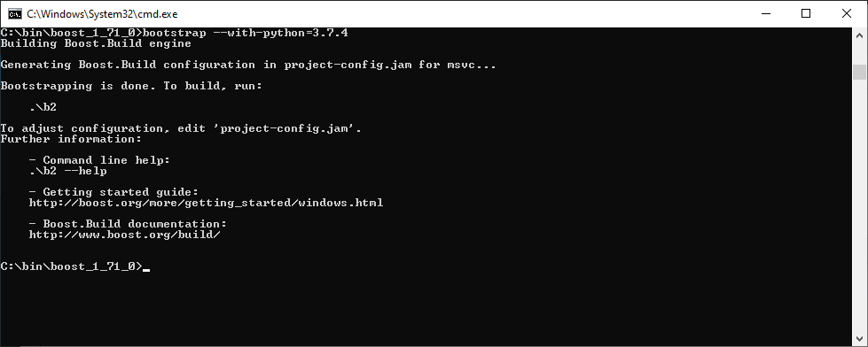
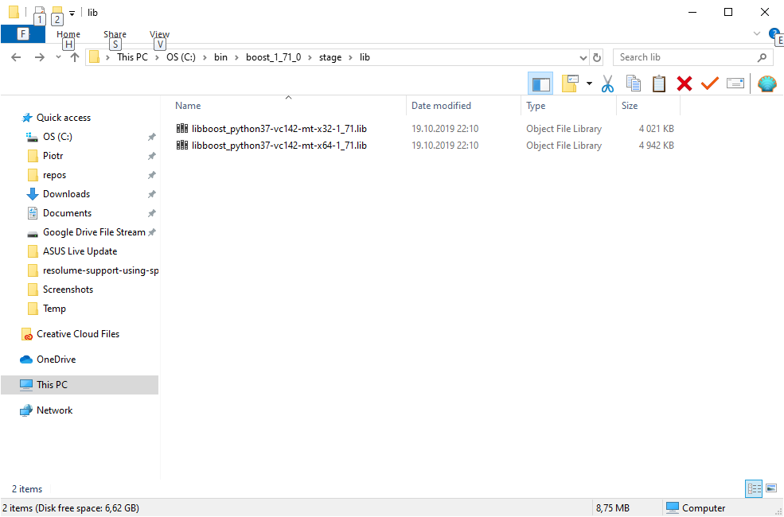
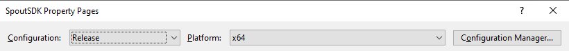
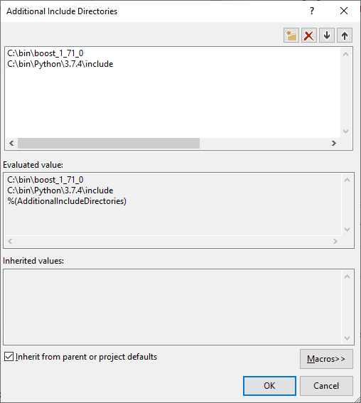
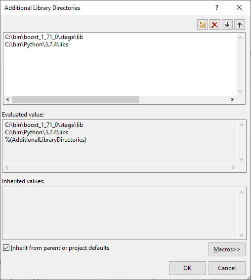
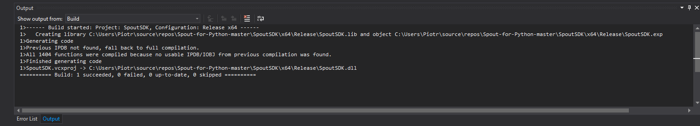
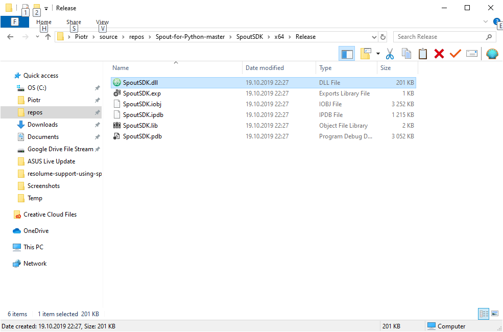

At some point, when  I was learning how to use OpenGL in python + pygame I decided to send stuff rendered directly to the Resolume in real-time. There is SpoutSDK available for C++ and I found a .pyd library that supported SpoutSDK API directly in Python, unfortunately, this lib was compiled only for x86 architecture and I was unable to use it in my x64 project. I tried to compile it by following the instructions located in repository README but failed to do so, and after a little struggle I managed to compile it by myself.

## Prerequisites
* [Visual Studio](https://visualstudio.microsoft.com/downloads)
* [Boost](https://www.boost.org/) (I personally used version 1.71 and it worked just fine)
* [Source code of Spout-for-Python](https://github.com/spiraltechnica/Spout-for-Python) cloned or downloaded
* [Python3](https://www.python.org/downloads/)

## Prepare Boost
Unpack boost

Open boost directory in terminal and type

```shell
bootstrap --with-python=3.7.4
```

**Note**: `--with-python` can be used to determine any python version, so feel free to change this flag to any version you wish to use Spout-for-Python with.



Next, create user-config.jam file and add:

```shell
using python : 3.7.4 : C:\\bin\\Python\\3.7.4 : C:\\bin\\Python\\3.7.4\\include : C:\\bin\\Python\\3.7.4\\libs ;
```

where `C:\\bin\\Python\\3.7.4` is path to your python

Next, in boost directory run following:
```shell
b2.exe --with-python python-debugging=off threading=multi variant=release link=static stage
```

This will create a static python library for x32 and x64 in `stage/lib` directory.



Now you have to run Visual Studio and open Spout-for-Python

## Prepare Visual Studio project

Before compiling library we have to set configuration scope and platform and add additional directories in the properties

In Visual Studio: Right-click on `SpoutSDK` and select scope and platform:



### Add Additional Include Directories

In Visual Studio: Right-click on `SpoutSDK` -> navigate to `C/C++ -> General -> Additional Include Directories` and add your boost root dir and python `/include` dir – see screenshot



### Add Additional Library Directories

In Visual Studio: Right-click on `SpoutSDK` -> navigate to `Linker -> General -> Additional Library Directories` and add your boost `stage/lib` dir and python `/libsdir` – see screenshot



Everything is now set up and ready to be compiled. The last thing to do is to select which scope and platform you want to compile:


Press **CTRL + SHIFT + B** and .dll will build:





Copy `SpoutSDK.dll` to your python’s project and rename it to `SpoutSDK.pyd`, so it can be imported directly. Using it is as simple as:

```python
import SpoutSDK
 
class SpoutSender:
    def __init__(self, name, resolution):
        # init spout sender
        self.sender = SpoutSDK.SpoutSender()
        self.width, self.height = resolution
        self.sender.CreateSender(name, self.width, self.height, 0)
        self.texture = self.create_texture()
 
    def create_texture(self):
        # init spout sender texture
        texture = glGenTextures(1)
 
        glBindTexture(GL_TEXTURE_2D, texture)
        glTexParameterf(GL_TEXTURE_2D, GL_TEXTURE_WRAP_S, GL_CLAMP_TO_EDGE)
        glTexParameterf(GL_TEXTURE_2D, GL_TEXTURE_WRAP_T, GL_CLAMP_TO_EDGE)
        glTexParameteri(GL_TEXTURE_2D, GL_TEXTURE_MAG_FILTER, GL_NEAREST)
        glTexParameteri(GL_TEXTURE_2D, GL_TEXTURE_MIN_FILTER, GL_NEAREST)
        # fill texture with blank data
        glCopyTexImage2D(GL_TEXTURE_2D, 0, GL_RGBA, 0, 0, self.width, self.height, 0);
        glBindTexture(GL_TEXTURE_2D, 0)
 
        return texture
 
    def send(self):
            #bind our texture and copy the window's contents into the texture
            glBindTexture(GL_TEXTURE_2D, self.texture)
            glCopyTexImage2D(GL_TEXTURE_2D, 0, GL_RGBA, 0, 0, self.width, self.height, 0);
            glBindTexture(GL_TEXTURE_2D, 0)
            # send texture to Spout
            self.sender.SendTexture(self.texture, GL_TEXTURE_2D, self.width, self.height, True, 0)
 
spout_sender = SpoutSender('Spout Python Sender', (800, 600))
```