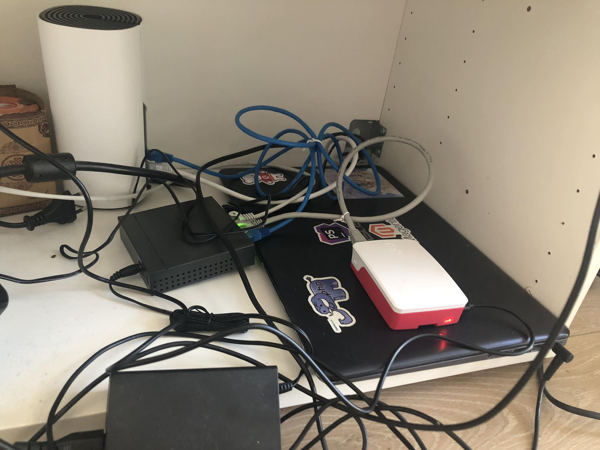
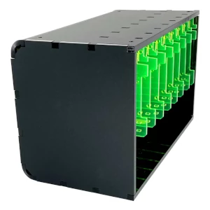

There are quite a few tools I would like to play around with and test under relatively friendly conditions (without time pressure)
to get a sense of how I might work with them in the future, with remote access and orchestration via Kubernetes.

Currently on my list, in no particular order, are Grafana, Prometheus, Apache Kafka,
Apache Cassandra, Kubernetes, Helm, Ansible, ElasticSearch, Kibana, RabbitMQ, Redis, NixOS, OpenTelemetry, Rancher, ArgoCD, Terraform.

Some time ago, I came across an interesting setup of a local Kubernetes cluster using Raspberry Pi, and it inspired me to prepare something similar for fun.

## Current setup

`charmander` - a k3s control-plane running on a Raspberry Pi 4B 4GB, which will solely orchestrate the creation of pods on Pikachu.

`pikachu` - a k3s agent running on an old Asus laptop that has been gathering dust on a shelf for a while now (16GB RAM, 1TB HDD).

## Future plans

Currently, there's only one Raspberry Pi (4B 4GB), loosely connected to a switch via Ethernet, with an independent dedicated power supply connected to a USB-C port. I'd like to introduce a few improvements:

Instead of independent USB-C power, I want to utilize Power over Ethernet (PoE), reducing the amount of wiring required.

I plan to move the Raspberry Pi to a dedicated mini-rack that I purchased for the cluster. It looks quite intriguing:

I also want the cluster to be accessible via the internet, using subdomains like *.infra.rusin.work (e.g., grafana.infra.rusin.work).
I'll use inlets for that (https://docs.inlets.dev/ ).

The mini-rack itself will be expanded with additional Raspberry Pis as soon as they become available again in Poland at a reasonable price.
Currently, availability is unfortunately limited due to global chip shortage.

Nevertheless, this setup should suffice for an indefinite period of time.