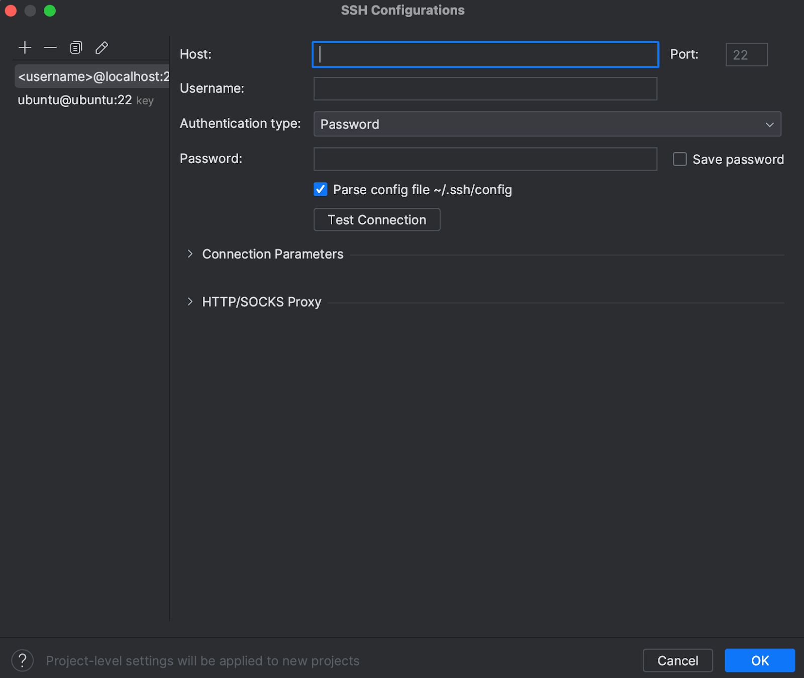
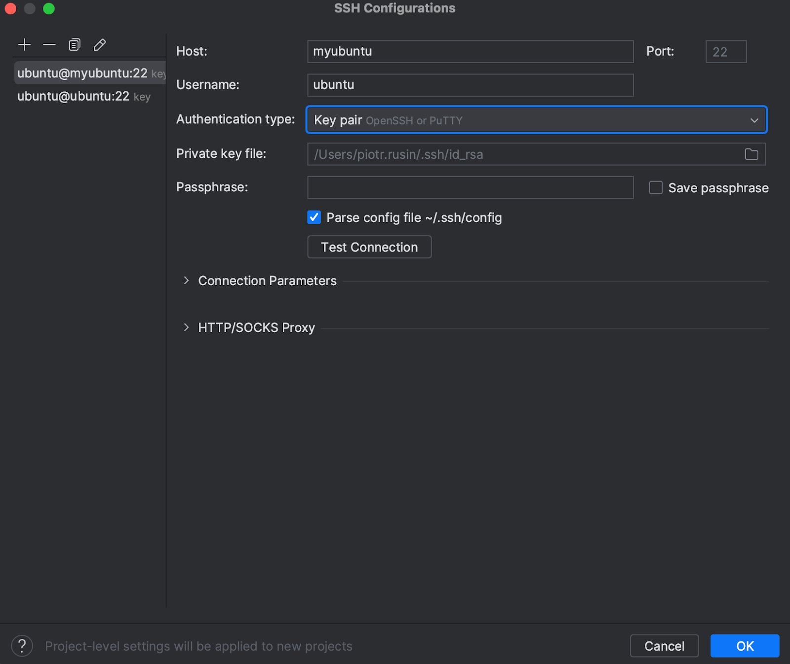
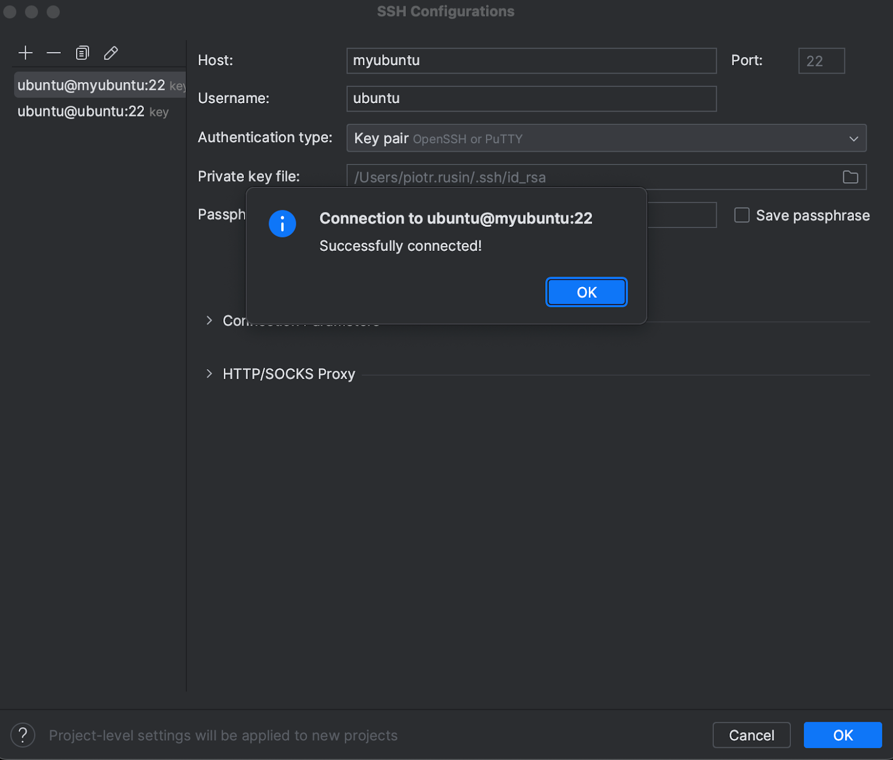
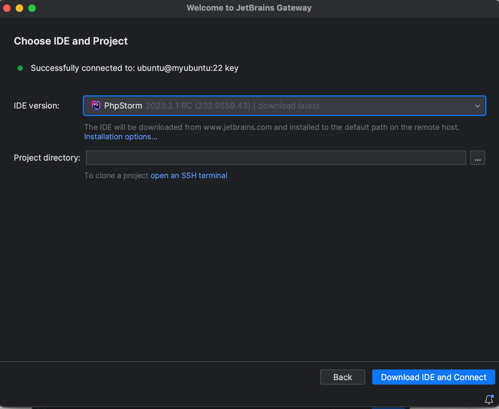
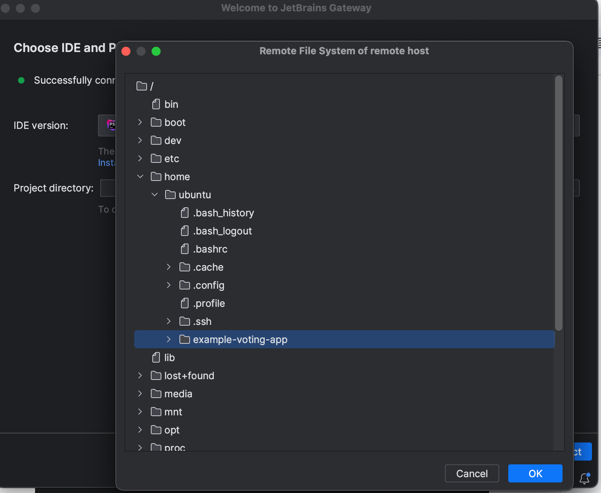
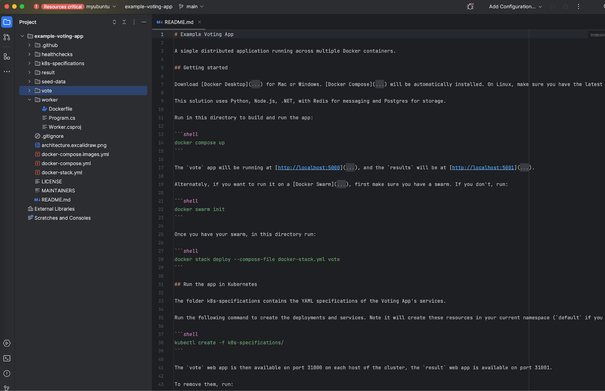

Docker can be quite problematic on macOS, but fortunately, it can be managed effectively. Below, I describe my current setup, which is not without its flaws but allows me to work efficiently. In a nutshell, I utilize Multipass for virtualizing Ubuntu and JetBrains Gateway for communication with the virtual machine over SSH, providing full IDE functionality and volume mounting speed comparable to that of Linux.

This setup is relatively straightforward to assemble and significantly improves work compared to the native Docker solution on macOS.

## Step I - Installing Multipass and Creating an Instance

To begin, install [Multipass](https://multipass.run/docs/installing-on-macos) and create a new instance.
Adjust the hardware specifications according to your needs and capabilities:

```
multipass launch jammy --name myubuntu -c 1 -d 10G -m 2G
```

"jammy" is an alias for Ubuntu 22.04. You can find a list of all aliases [here](https://multipass.run/docs/create-an-instance#heading--create-an-instance-with-a-specific-image).

`-c` specifies the number of CPUs.

`-d` specifies disk space.

`-m` specifies memory size.

After a short while, you will be able to connect to the machine. First, check the assigned IP:

```
multipass info myubuntu

Name:           myubuntu
State:          Running
IPv4:           192.168.64.5
Release:        Ubuntu 22.04.3 LTS
Image hash:     9c59c6097711 (Ubuntu 22.04 LTS)
Load:           0.36 0.10 0.04
Disk usage:     1.4G out of 9.5G
Memory usage:   148.9M out of 1.9G
Mounts:         --
```

Before gaining access to the machine, copy your public SSH key to the authorized\_keys file on the instance:

```
multipass transfer ~/.ssh/id_rsa.pub myubuntu:/home/ubuntu/.ssh/authorized_keys
```

Now you can connect:

```
ssh ubuntu@192.168.64.5

Welcome to Ubuntu 22.04.3 LTS (GNU/Linux 5.15.0-79-generic aarch64)
```

Another helpful step is to add an entry to `/etc/hosts` with the instance's IP:

```
sudo nano /etc/hosts
```

Add the following entry:

```
192.168.64.5 myubuntu
```

The first step is completed. Now let's prepare JetBrains Gateway for work.

## Step II - Preparing JetBrains Gateway for Work

For the purpose of this post, I'll use a sample PHP project that I'll clone on the instance:

```
ssh ubuntu@myubuntu
```

```
git clone https://github.com/dockersamples/example-voting-app
```

JetBrains Gateway is a new solution from JetBrains that is currently under active development.

You can download it [here](https://www.jetbrains.com/remote-development/gateway/).

Configuration is simple: (1) add a new project, (2) configure the SSH connection, (3) download the IDE on which you want to work.

Below are screenshots of the entire process.

Setting up SSH connection:






Successfully connected:



Setting up project - IDE selection:



Setting up project - working directory selection:



Setting up project - connection:


JetBrains Gateway has certain hardware requirements that are worth exceeding on the instance to prevent the client from disconnecting randomly and to ensure efficient work.


Connecting...


Voilà! Project is set up, and ready to work.



## Summary

(1) This post skipped details like installing docker - I believe that you can handle that well using available resources.

(2) Instance IP will probably different on your machine once you set it up, so use it instead of the one posted here.
You can check it through `multipass info <instancename>`

(3) It's good to set significant amount of resources for JetBrains to avoid disruption during work.
For my day-to-day work I use 16GB mem, 250GB storage, 8 cpu instance, and it works fine.
