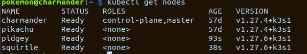

HP T630 terminals (8GB RAM and 128SSD) arrived some time ago, but when ordering them I didn't notice that they only support DVI.

It took me a while to order the appropriate adapter (on the way I ordered a DVI-HDMI adapter which... turned out to plain not to work at all)

Two nodes joined the cluster today - `pidgey` and `squirtle`

&nbsp;

